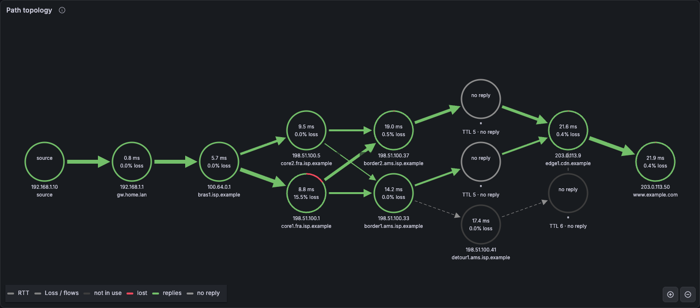
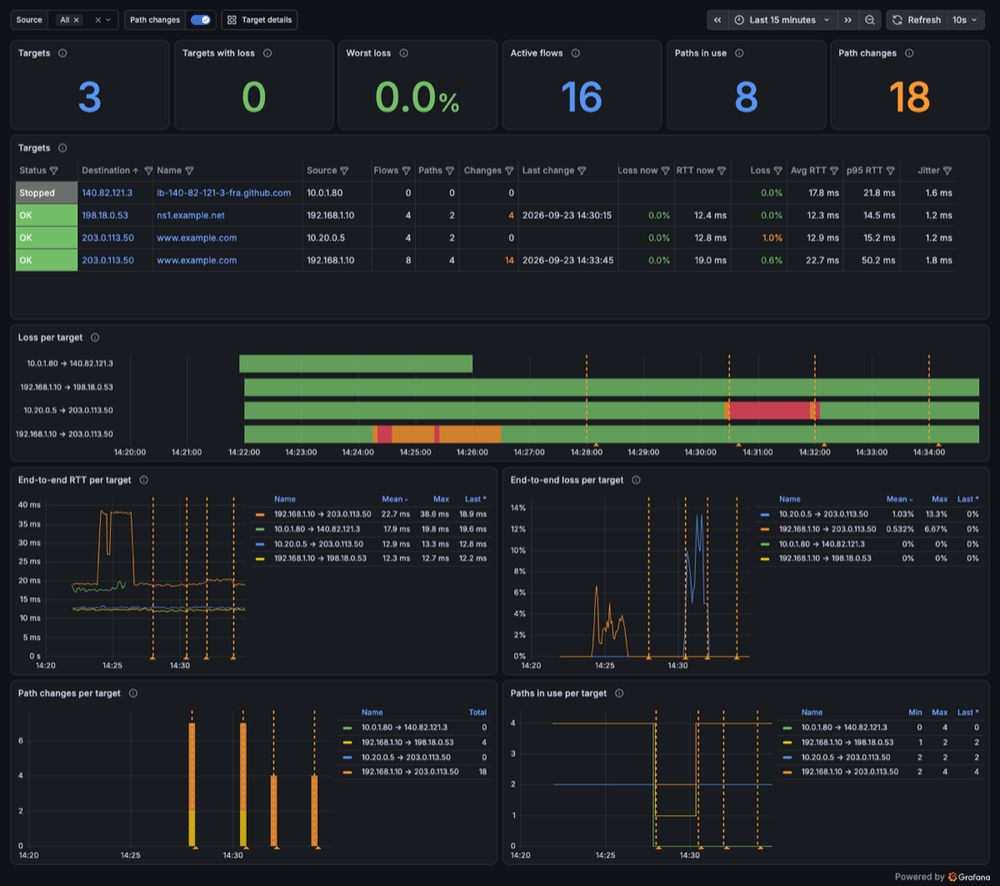

# ETR monitoring example

Prometheus + Grafana stack that turns `etr -j` output into a live view of the
ECMP paths towards your targets and how they change over time: which hops
each flow crosses, where latency is added, where packets are lost, and when a
flow moves to a different path.

A *target* is a destination as traced from one source. The same destination
probed from two machines is two targets, each with its own paths.



## Quick start (demo data)

No root or real target needed. The `demo` profile writes synthetic etr output
for three targets from two sources (`home` to a web server and a name server,
`office` to the same web server) across a small ECMP network. It replays a
12-minute incident cycle: congestion on one border router, a core router
outage that reroutes the flows of two targets, loss on the office uplink, and
a detour that adds a hop.

```bash
cd examples/monitoring
docker compose --profile demo up -d --build
```

Open <http://localhost:3000/d/etr-overview> and click a target to drill down.
Anonymous users can view the dashboards; log in as admin/admin to edit them.
Give it a few minutes to collect some history.

For a larger picture, the `fleet` profile simulates a company WAN. Six sites
(fra, ams, lon, nyc, sin, syd) probe each other and two public services, for 42
targets in total. It also has scripted incidents on shared links: a degraded
and then a cut transatlantic link, loss on one site's internet breakout, and a
congested backhaul. Open it in the [Fleet dashboard](#fleet):

```bash
docker compose --profile fleet up -d --build          # or: --profile demo --profile fleet
```

Probing many sites is a scaling problem of its own. See
[SCALING.md](SCALING.md) for an architecture with one exporter per site
feeding a central TSDB.

## Monitoring a real destination

```bash
cd examples/monitoring
docker compose up -d --build

# from the repo root
go build -o etr ./cmd/etr
mkdir -p examples/monitoring/data
sudo ./etr -j examples/monitoring/data/etr.json -P 8 --no-tui 192.0.2.1
```

- Each parallel probe (`-P`) uses its own source port (from `-s`, default
  50000), so it is a separate flow and can hash onto a different ECMP path.
  More probes show more of the paths.
- The exporter follows every `data/*.json` file, so you can run several etr
  instances side by side, each writing its own file (for example, one per
  destination or one TCP and one UDP). Give each run its own file: `etr -j`
  truncates the file when it starts.
- To add another source, run etr on that machine and have it write into
  `data/` over a shared mount (NFS, sshfs, …). The source IP in the JSON keeps
  its targets apart.
- `etr -j` truncates its file on start; the exporter notices and starts
  reading the new file from the beginning.
- `-a` adds ASN lookups, which show up in the node details and tables.

If you ran the previous version of this example, remove its old volumes first:
`docker compose -p monitoring down -v`.

## Dashboards

### Overview

All targets at a glance (`/d/etr-overview`, filterable by source):



- **Targets** table: one row per target with status (OK, degraded ≥ 1% loss,
  down ≥ 50% loss, or stopped), loss and RTT over the last minute, the
  number of flows and paths in use, path changes, and loss, RTT and jitter over
  the selected time range. Click a destination or name to open the target.
- **Loss per target**: a health timeline, one row per target.
- End-to-end **RTT** and **loss**, **path changes** and **paths in use** per
  target. Click a series to open that target. Path changes on several targets
  at the same time usually point to a shared hop.

### Fleet

Every site at a glance (`/d/etr-fleet`, filterable by source site, target
class and time window). It is built only from the low-cardinality
`etr_target_*` and `etr_hop_transit_*` metrics, so it also works on a central
TSDB that doesn't have the per-flow detail. It needs a [sites file](#sites).


- **Site × site** matrices: end-to-end loss and average RTT from each source
  site (rows) to each target site (columns). A bad row points at the source
  site, a bad column at the target site, and a block of cells at a link
  between regions.
- **Worst targets**: the 20 targets with the most loss. Click a source or
  destination to open the target.
- **Shared hops**: routers crossed by several targets, ranked by the loss of
  the traffic that goes through them. When many targets suffer at once, the
  shared hop with the most loss is where to look first.
- Loss, RTT and path changes per site pair, and loss through shared hops,
  over time.

### Target details

The deep dive into one target (`/d/etr-paths`). Pick it with the
*Destination* and *Source* variables, and narrow it down to some flows with
*Flow (source port)*.

**Summary**: the destination's name, end-to-end loss, median and p95 RTT,
jitter, the number of paths in use and the number of path changes in the
selected time range.

**Path topology** (Node Graph): every hop seen in the time range, laid out by
TTL, with the source on the left.

- **Nodes** show average RTT and reply loss. The ring is green for replies and
  red for lost probes. Grey nodes are hops that never answer (`*`). Hops that
  only appear on paths no longer in use have a dark ring.
- A **red node** means *forwarding loss*: loss that also shows up at every
  later hop, so packets really are dropped at or behind it.
- **Edges** are colored by forwarding loss at their target (green < 1% <
  orange < 5% < red). Their width is the number of flows using them. Dashed
  grey edges belong to paths that are no longer in use. Hover over an edge to
  see the RTT the hop adds.
- Click a node or an edge for details: PTR, ASN, p95, jitter, flows and paths.

**Path changes**

- *Path per flow* is a state timeline showing which path (`#N`) each flow used
  over time.
- The *Path change log* lists each change with the TTL where the old and new
  paths diverge and the hop before and after.
- The *Paths* table lists every distinct path with its route, the flows using
  it, and its end-to-end RTT and loss.
- Path changes also show up as annotations on the time series panels.

**Latency and loss per flow**: end-to-end RTT, loss and jitter per source
port, plus an RTT heatmap. Flows on paths with different latency separate
clearly here.

**Hops**

- RTT and reply loss by hop over time.
- An MTR-style *Hop report* table.
- A *Flows* table with the current path of every flow. Use a flow's source
  port, for example `iperf3 --cport 50003`, to send test traffic along the
  same path.

### Reply loss vs forwarding loss

Many routers rate-limit the ICMP replies they generate. A hop that drops 15%
of *replies* while every hop behind it answers fine is not dropping traffic.
The exporter therefore also calculates forwarding loss for each hop: the
lowest loss seen at that hop or any later hop, for the flows that cross it. In
the demo, `core1` shows about 15% reply loss but almost no forwarding loss, while
congestion on `border2` shows up as forwarding loss on it and everything
behind it.

### How paths are tracked

- A path is the sequence of hop IPs for one flow (source and destination IP,
  protocol, destination port and source port). Paths are numbered per target
  in the order they are first seen.
- A single lost reply is not a path change. The exporter keeps the last IP
  seen at each TTL, and probes where the answering hops agree with it count
  as the same path.
- A change is recorded when a hop answers from a different IP, or when the
  path gets longer or shorter.

## Exporter

The exporter (`exporter/`) follows the etr JSON files like `tail -F`. It
serves Prometheus metrics on `:8080/metrics` and a small JSON API that
Grafana queries through the
[Infinity](https://grafana.com/grafana/plugins/yesoreyeram-infinity-datasource/)
data source.

| Setting | Env | Default | |
|---|---|---|---|
| `-input` | `ETR_JSON_FILE` | `/data/*.json` | File or glob to follow |
| `-listen` | `ETR_LISTEN` | `:8080` | HTTP listen address |
| `-retention` | `ETR_RETENTION` | `1h` | Probe history kept in memory for the JSON API (topology, tables) |
| `-stale` | `ETR_STALE` | `2m` | Flows silent this long are considered stopped |
| `-sites` | `ETR_SITES` | | [Sites file](#sites) for the fleet metrics (compose mounts [`sites.txt`](sites.txt)) |

The topology and tables cover the last `ETR_RETENTION` at most. The time
series come from Prometheus, which keeps 7 days.

### Sites

The fleet metrics label sources and destinations with a site and a class,
read from a text file of `<ip or prefix> <site> [class]` lines:

```text
10.1.0.0/16    fra        wan
203.0.113.50   www        public
```

The longest matching prefix wins. Addresses without a match are their own
site with class `other`. The exporter reads the file on start.

### Metrics

Flow labels: `source`, `destination`, `protocol`, `dst_port`, `src_port`. Hop
metrics add `ttl` and `hop_ip`. A hop that never answers has `hop_ip="*"`.

| Metric | Type | Description |
|---|---|---|
| `etr_probe_runs_total` | counter | Completed probe iterations per flow |
| `etr_destination_reached_total` | counter | Iterations that got a reply from the destination |
| `etr_destination_rtt_seconds` | histogram | End-to-end RTT per flow |
| `etr_destination_jitter_seconds` | gauge | Smoothed end-to-end RTT variation (RFC 3550) |
| `etr_flow_path_index` | gauge | Current path number (`#N`) of the flow |
| `etr_flow_path_changes_total` | counter | Times the flow moved to a different path |
| `etr_flow_hops` | gauge | Hops in the flow's current path |
| `etr_flow_last_probe_timestamp_seconds` | gauge | Time of the flow's last probe |
| `etr_destination_active_paths` | gauge | Distinct paths in use per target (`source`, `destination`) |
| `etr_destination_info` | gauge | `destination_ptr`, `destination_asn` |
| `etr_hop_sent_total` | counter | Probes per flow and TTL, attributed to the hop IP last seen there |
| `etr_hop_received_total` | counter | Replies per flow, TTL and hop IP |
| `etr_hop_rtt_seconds` | histogram | RTT to each hop per flow |
| `etr_hop_jitter_seconds` | gauge | Smoothed hop RTT variation |
| `etr_hop_info` | gauge | `hop_ptr`, `hop_asn` per `hop_ip` |
| `etr_exporter_parse_errors_total` | counter | Input lines that could not be parsed |

Fleet metrics are per target without flow or hop detail, labelled `source`,
`source_site`, `destination`, `target_site` and `target_class`. Transit
metrics are per `source_site` and `hop_ip`:

| Metric | Type | Description |
|---|---|---|
| `etr_target_probes_total` | counter | Probe iterations per target, all flows |
| `etr_target_reached_total` | counter | Iterations that reached the destination |
| `etr_target_rtt_seconds` | histogram | End-to-end RTT per target |
| `etr_target_path_changes_total` | counter | Times a flow of the target moved to a different path |
| `etr_target_paths` | gauge | Distinct paths in use |
| `etr_hop_transit_probes_total` | counter | Iterations whose path crossed the hop |
| `etr_hop_transit_reached_total` | counter | Of those, iterations that reached their destination |
| `etr_hop_transit_targets` | gauge | Targets whose current paths cross the hop |

`1 - transit_reached / transit_probes` is the end-to-end loss of all traffic
through a router. A router that only rate-limits its own ICMP replies doesn't
show up there, but a router that drops traffic for several targets does.

Loss is `1 - received / sent`, for example per target:

```promql
1 - sum by (source, destination) (rate(etr_destination_reached_total[5m]))
  / sum by (source, destination) (rate(etr_probe_runs_total[5m]))
```

Series are per flow and hop, so their number grows with
`targets × flows × hops` (about 2,850 per target with 8 flows and 15 hops).
That is fine for a site. For many targets, keep the detail at the site and
send only the fleet metrics (about 23 per target) to a central TSDB, as
described in [SCALING.md](SCALING.md).

### JSON API

All endpoints take the optional query parameters `source`, `destination` and
`src_port` (comma-separated lists) and `from`/`to` (Unix milliseconds; the
default is the last 15 minutes).

| Endpoint | Content |
|---|---|
| `/api/targets` | One row per target with status, loss, RTT and path counts |
| `/api/graph/nodes`, `/api/graph/edges` | Node Graph frames |
| `/api/paths` | Distinct paths with route, flows, RTT and loss |
| `/api/flows` | One row per flow with its current path |
| `/api/events` | Path changes, newest first |
| `/api/hops` | Per-hop report (reply and forwarding loss, RTT) |

### Development

```bash
cd examples/monitoring/exporter
go test -race ./...
go run . -input '../data/*.json'           # exporter on :8080
go run . demo -out ../data/demo.json       # synthetic etr output
go run . demo -scenario fleet -out ../data/fleet.json   # 6-site WAN mesh
```

The dashboards are provisioned from `grafana/dashboards/`. With
`allowUiUpdates`, you can edit them in Grafana and export them back to those
files.

## Stop and clean up

```bash
docker compose --profile demo --profile fleet down      # stop, keep history
docker compose --profile demo --profile fleet down -v   # also remove Prometheus/Grafana volumes
rm -rf data/                             # remove etr/demo JSON files
docker rmi etr-exporter                  # remove the locally built image
```
