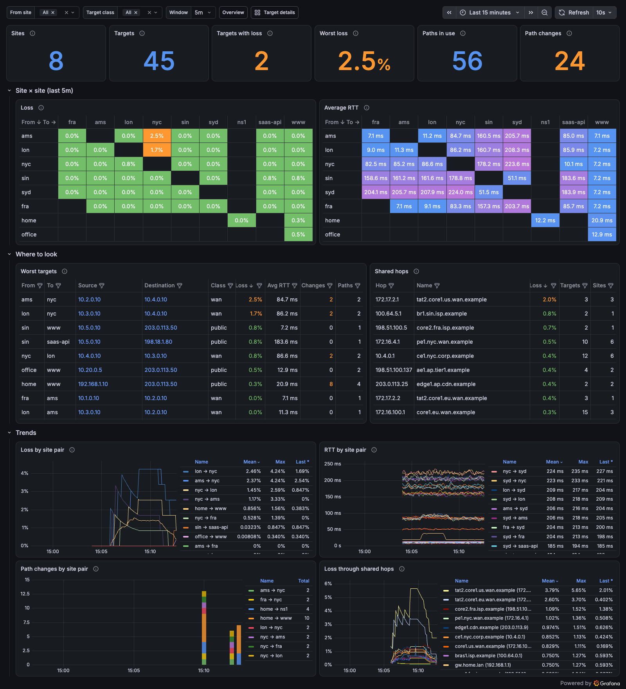
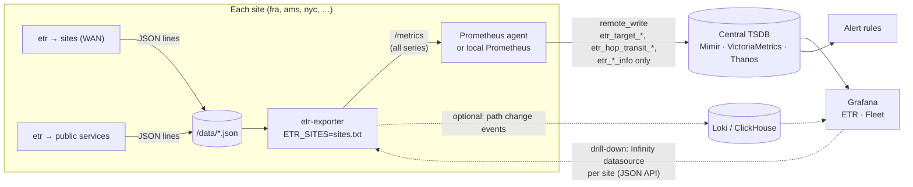

# Running etr monitoring at scale

The compose stack in this directory runs one exporter next to a handful of
etr processes. That works for tens of targets. This guide describes how to
scale the same pieces to a company with many locations. Each site probes the
other sites across the WAN, and also probes public services through its own
internet breakout.

The **ETR · Fleet** dashboard is built for that setup. To try it with a
simulated 6-site WAN:

```sh
docker compose --profile fleet up -d --build
open http://localhost:3000/d/etr-fleet
```



## What grows, and how fast

A *target* is one source → destination pair. Each site probes every other
site (N × (N − 1) targets) plus its public destinations. With 50 sites and
10 public services per site, that is 50 × 49 + 50 × 10 = **2,950 targets**.
With 8 flows each, that is about 24,000 flows.

The exporter produces three kinds of data, and they scale very differently:

| Data | Labels | Per target | 2,950 targets |
| --- | --- | --- | --- |
| Flow and hop detail (`etr_flow_*`, `etr_hop_*`, `etr_destination_*`) | source, destination, src_port, ttl, hop_ip | ~2,850 series (8 flows × 15 hops) | ~8.4 M series |
| Fleet metrics (`etr_target_*`) | source, source_site, destination, target_site, target_class | 23 series (4 without the RTT histogram) | ~68 k series |
| Transit metrics (`etr_hop_transit_*`) | source_site, hop_ip | 3 series per site and router | ~45 k series (50 sites × 300 routers) |
| Probe records for topology and path history (JSON API) | – | ~1.2 KB per probe run, kept for `ETR_RETENTION` | ~55 GB per hour at a 2 s interval |

We measured the detail numbers with one exporter holding an hour of
data (8 flows × 15 hops per target, 2 s interval):

| Targets | Exporter heap | Series | `/api/targets` | Topology graph |
| --- | --- | --- | --- | --- |
| 10 | 180 MB | 29 k | 58 ms | 355 ms |
| 100 | 1.8 GB | 285 k | 0.7 s | 0.4 s |
| 250 | 4.5 GB | 713 k | 4.5 s | 1.3 s |

In short, the detail is cheap per site and expensive globally. The fleet
and transit metrics are small enough to keep centrally for every target.

## Architecture



There are three tiers:

1. **Site (detail).** Every site runs its own etr processes and exporter.
   All flow and hop metrics and the probe records stay here, in the
   exporter's memory for the JSON API and optionally in a small local
   Prometheus with short retention. They cost little because a site only
   holds its own targets. The **ETR · Target details** dashboard (topology,
   ECMP paths, per-hop loss) reads from here.
2. **Central (fleet).** Each site forwards only the `etr_target_*`,
   `etr_hop_transit_*` and `etr_*_info` series to a central TSDB. The
   **ETR · Fleet** dashboard and the alert rules read from there. It answers
   *which site pairs, targets and shared routers are unhealthy right now*
   without any per-flow or per-hop series.
3. **Events (optional).** Path changes are events, not time series. Keeping
   them in a log or column store (Loki, ClickHouse) gives you "what changed,
   where and when" across the whole fleet. The exporter already exposes them
   on `/api/events`. A small shipper, or a future `-events-log` flag, can
   forward them.

## Site labels

The fleet metrics are labelled with sites, not just IPs. Mount a sites file
into the exporter and point `ETR_SITES` at it. The same file can be used at
every site:

```text
# <ip or prefix>   <site>     [class]
10.1.0.0/16        fra        wan
10.2.0.0/16        ams        wan
10.4.0.0/16        nyc        wan
203.0.113.50       www        public
198.18.1.80        saas-api   public
```

The longest matching prefix wins. The class (for example `wan`, `public`,
`dc` or `saas`) filters the Fleet dashboard and lets alert rules use
different thresholds for internal and public targets. See
[`sites.txt`](sites.txt) for the demo's mapping.

## Forwarding only the fleet metrics

Run a Prometheus in agent mode (or Grafana Alloy) next to each exporter.
Scrape everything, and remote-write only what the central tier needs:

```yaml
# prometheus-agent.yml at site "fra": prometheus --agent --config.file=…
global:
  scrape_interval: 15s
  external_labels:
    exporter_site: fra        # which site's exporter to open for drill-down

scrape_configs:
  - job_name: etr
    static_configs:
      - targets: ["etr-exporter:8080"]

remote_write:
  - url: https://mimir.example.com/api/v1/push
    write_relabel_configs:
      - source_labels: [__name__]
        regex: "etr_target_.*|etr_hop_transit_.*|etr_hop_info|etr_destination_info|up"
        action: keep
      # Optional: forward only the RTT sum and count (average RTT) instead of
      # the full histogram. That is 6 series per target instead of 23.
      # - source_labels: [__name__]
      #   regex: "etr_target_rtt_seconds_bucket"
      #   action: drop
```

If you run a full local Prometheus instead of an agent, keep the detail for
a few days there, and use the same `write_relabel_configs` for the central
copy.

## Alerting

Alert on the fleet metrics centrally, so one rule covers every site:

```yaml
groups:
  - name: etr
    rules:
      - record: etr:target_loss:ratio5m
        expr: |
          1 - sum by (source, source_site, destination, target_site, target_class) (increase(etr_target_reached_total[5m]))
            / (sum by (source, source_site, destination, target_site, target_class) (increase(etr_target_probes_total[5m])) > 0)

      - alert: EtrTargetLoss
        expr: etr:target_loss:ratio5m{target_class="wan"} > 0.02
        for: 5m
        annotations:
          summary: "{{ $labels.source_site }} → {{ $labels.target_site }}: {{ $value | humanizePercentage }} loss"

      # Several targets losing traffic through the same router is one
      # incident, not many: alert on the hop instead of on each target.
      - alert: EtrSharedHopLoss
        expr: |
          (1 - sum by (hop_ip) (increase(etr_hop_transit_reached_total[5m]))
             / (sum by (hop_ip) (increase(etr_hop_transit_probes_total[5m])) > 0)) > 0.02
          and on (hop_ip) sum by (hop_ip) (etr_hop_transit_targets) >= 3
        for: 5m
        annotations:
          summary: "Loss through {{ $labels.hop_ip }}"

      - alert: EtrPathChurn
        expr: sum by (source_site, target_site) (increase(etr_target_path_changes_total[15m])) > 10
        annotations:
          summary: "{{ $labels.source_site }} → {{ $labels.target_site }} keeps changing paths"
```

## Drill-down to a site

The Target details dashboard reads topology and path history from an
exporter's JSON API, so it has to query the exporter that holds the target:

- **One Infinity datasource per site** (`etr-fra`, `etr-ams`, …), created
  through provisioning, plus a datasource variable on the Target details
  dashboard. Add `&var-site=${__data.fields.source_site}` to the Fleet
  dashboard's links so that the right one is picked.
- **Or one reverse proxy** that routes `/<site>/api/…` to the right
  exporter. Replace `http://etr-exporter:8080` in the dashboards with
  `https://etr-proxy.example.com/${site}`.

The Prometheus panels on Target details keep working if the central TSDB
also receives the detail series for the targets you drill into. If it
doesn't, point them at the site's local Prometheus.

## Probe budget

Every flow sends one probe per hop per iteration. For the example above:

```text
2,950 targets × 8 flows × 15 hops / 2 s   ≈ 177,000 probes/s worldwide
2,950 targets × 2 flows × 15 hops / 15 s  ≈   5,900 probes/s worldwide
```

Most of the answers come from routers' control planes. They rate-limit ICMP
TTL-exceeded replies, often to a few hundred per second per router or less.
A core router that every site crosses sees the sum of all sites' probes. If
the probe rate is too high, you measure the rate limiter and not the
network. Guidelines:

- **Probe WAN targets every 10–30 s** (`etr -d 15s`) with 2–4 flows. Use
  more flows only where ECMP coverage matters, for example on
  transatlantic links. Public targets need even fewer.
- **Watch "Reply loss" versus "Forwarding loss"** on Target details. A
  router that suppresses replies but forwards the traffic shows reply loss
  on itself and no loss behind it. The fleet metrics use end-to-end
  reachability only, so rate limiting on transit routers doesn't raise
  alerts.
- **Stagger start times** so that sites don't probe in lockstep.
- **Use `-n`** (no reverse DNS) on busy probes to avoid a DNS lookup for
  every new hop. The Fleet dashboard names targets by site anyway.

## What to change in the exporter for large sites

The exporter in this example keeps it simple. For sites with hundreds of
targets, consider these changes:

- **Pre-aggregate the probe records.** The JSON API keeps every probe run
  for `ETR_RETENTION`. Per-path, per-hop buckets (for example one minute)
  would cut memory by 10–100×.
- **Delete series for targets that are gone.** Gauges are removed after
  `ETR_STALE`, but counters and histograms stay until restart. With a
  changing target list they add up.
- **Make the hop detail optional.** A flag to drop `src_port` from the hop
  metrics would turn the ~2,850 series per target into a few hundred and
  keep most of the insight.
- **Run one exporter per etr host.** Exporters don't share state, and the
  Fleet dashboard aggregates across them with `sum by`, so you can split
  the targets of a large site over several probe hosts.
